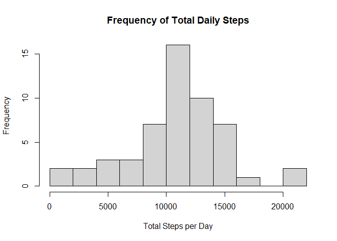
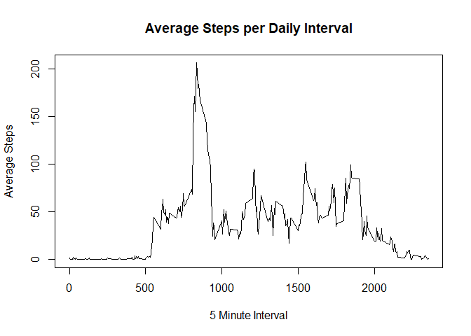
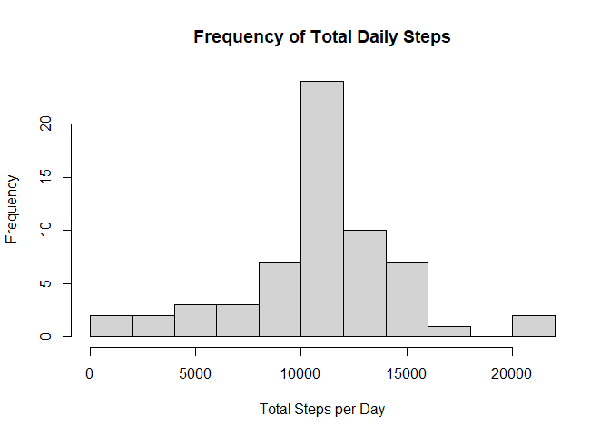
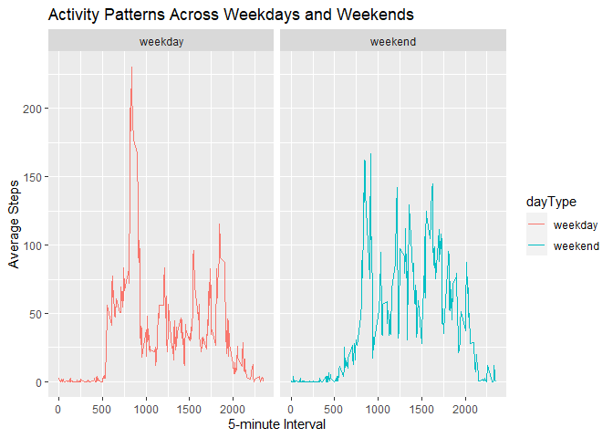

## Loading and preprocessing the data

Looks for .csv file and reads it if found. If not, unpacks .zip file containg .csv file, then reads it.

```r
if(!file.exists("activity.csv")){unzip("activity.zip")}
activity <- read.csv("activity.csv")
```

## What is mean total number of steps taken per day?

Sums total steps for each day. Then plots the frequency of the totals.

```r
stepsperday <- aggregate(steps ~ date, data = activity, sum)
with(stepsperday, hist(steps, main = "Frequency of Total Daily Steps", xlab = "Total Steps per Day", breaks = 10))
```

<!-- -->

Mean and Median for total steps taken each day.

```r
mean(stepsperday$steps)
```

```
## [1] 10766.19
```

```r
median(stepsperday$steps)
```

```
## [1] 10765
```

## What is the average daily activity pattern?

Find mean steps taken at each 5-minute time interval, and plots data.

```r
avgdaily <- aggregate(steps ~ interval, data = activity, mean)
with(avgdaily, plot(interval, steps, type = "l", main = "Average Steps per Daily Interval", ylab = "Average Steps", xlab = "5 Minute Interval"))
```

<!-- -->

Find max of average steps over all 5-minute intervals.

```r
avgdaily[which(avgdaily$steps == max(avgdaily$steps)),]
```

```
##     interval    steps
## 104      835 206.1698
```

## Imputing missing values

Index the missing values in the dataset, and find the total number of NA's.

```r
sum(is.na(activity$steps))
```

```
## [1] 2304
```

Fill in missing values in dataset with mean steps for that interval.

```r
impActivity <- activity
for(i in 1:nrow(impActivity)){
  if(is.na(impActivity$steps[i])){
    mean <- avgdaily$steps[which(avgdaily$interval==impActivity$interval[i])]
    impActivity$steps[i] <- mean
  }
}
```

Plot total steps per day from imputed dataset, and report mean and median of steps per day.

```r
impStepsPerDay <- aggregate(steps ~ date, data = impActivity, sum)
with(impStepsPerDay, hist(steps, main = "Frequency of Total Daily Steps", xlab = "Total Steps per Day", breaks = 10))
```

<!-- -->

```r
mean(impStepsPerDay$steps)
```

```
## [1] 10766.19
```

```r
median(impStepsPerDay$steps)
```

```
## [1] 10766.19
```
The mean value does not change after imputing missing values, however the median does.

## Are there differences in activity patterns between weekdays and weekends?

Create new weekday variable dayType in dataset, indicating whether date is weekday or weekend

```r
impActivity$date <- as.Date(impActivity$date)
weekday <- as.factor(weekdays(impActivity$date))
levels(weekday) <- list("weekday" = c("Monday", "Tuesday", "Wednesday","Thursday","Friday"),
                        "weekend" = c("Saturday", "Sunday"))
impActivity <- cbind(impActivity, "dayType" = weekday)
```

Panel plot comparing avg. steps taken per 5-minute interval across weekdays and weekends.

```r
library(ggplot2)
comparisonavg <- aggregate(steps ~ interval + dayType, data = impActivity, FUN = "mean")
qplot(interval, steps, data=comparisonavg, facets = .~dayType, geom = "line", col = dayType, ylab = "Average Steps", xlab = "5-minute Interval", main = "Activity Patterns Across Weekdays and Weekends")
```

<!-- -->

